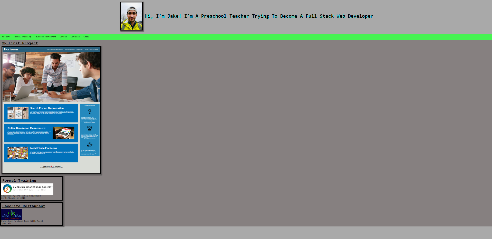

# prof-portfolio-proj

Created a portfolio website for myself.

# Steps taken

* Started by making a frame of a portfolio page with html
* Added a Nav section with loose idea of sections of page
* Added first project and made a clickable picture/link
* Added two more sections to help round out page
* Used CSS to style page

